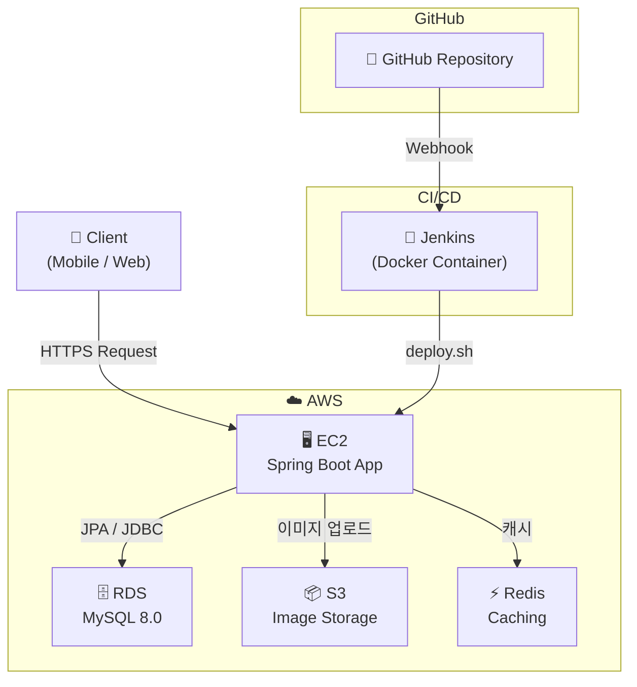
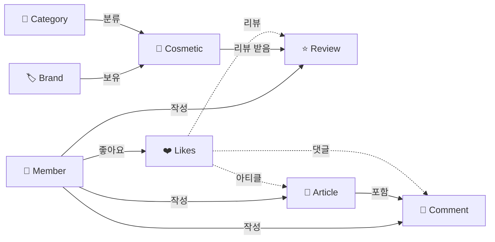

# BeautemTalk 🌸

<div align="center">

**가장 솔직한 뷰티 커뮤니티**

방황하는 뷰티 유목민들을 위한 맞춤형 정보와 리얼 리뷰를 만나보세요.

<!-- 서비스 메인 목업 이미지 -->


</div>

<br/>

## 📝 서비스 소개

> **BeautemTalk은 내 피부 타입에 맞는 화장품 리뷰를 확인하고, 솔직한 뷰티 커뮤니티를 경험할 수 있는 서비스입니다.**

- 🧴 **화장품 리뷰** - 광고 없는 솔직한 리뷰와 평점
- 👤 **뷰티 프로필** - 나의 피부 타입·고민을 기록하여 맞춤형 추천
- 📰 **뷰티 아티클** - 뷰티 정보 공유 및 커뮤니티 소통
- ❤️ **좋아요 & 댓글** - 리뷰, 아티클, 댓글에 반응하기


<br/>

## 🏗️ System Architecture



<br/>

## 🗄️ Domain Diagram



<br/>

## 🛠️ Tech Stack

### Backend


### Infrastructure


### DevOps & Docs


### Co-Work Tool


<br/>

## 💡 기술 스택 선정 이유

| 기술 | 선정 이유 |
|------|----------|
| **Spring Boot 3.3** | 자동 설정과 스타터 의존성으로 빠른 개발 및 배포 가능, 최신 LTS 호환 |
| **Java 17** | 장기 안정성 보장 LTS 버전, Record·Sealed Class 등 최신 문법 활용 |
| **Spring Security + OAuth2 + JWT** | Google/Kakao/Naver 소셜 로그인 지원, Stateless 인증으로 서버 확장성 확보 |
| **Spring Data JPA** | 객체 지향 방식 DB 접근, 도메인 중심 설계와 가능 |
| **AWS RDS (MySQL 8.0)** | 서버 유지보수 없는 관리형 DB 서비스 |
| **AWS S3** | 화장품 이미지·프로필 사진 관리를 위한 고가용성 객체 스토리지 |
| **Redis** | 자주 조회되는 데이터 캐싱으로 DB 부하 감소 및 응답 속도 향상 |
| **Docker & Docker Compose** | 개발/운영 환경 일관성 유지, 로컬 MySQL·Redis 손쉬운 실행 |
| **GitHub Actions** | CI/CD 자동화로 빌드·테스트·배포 워크플로우 효율화 |
| **Swagger** | API 문서화 및 프론트엔드 협업 원활화 |

<br/>


## 📌 Convention

### Naming Convention

| 대상 | 규칙 | 예시 |
|------|------|------|
| 파일 | PascalCase | `MemberService.java` |
| 클래스 | PascalCase | `class MemberService` |
| 함수/변수 | camelCase | `getUserInfo()` |
| DB 컬럼 | snake_case | `member_id` |
| 엔드포인트 | REST 준수 | `GET /api/members/{id}` |

### Branch Naming Convention

```
main
develop
feature/
hotfix/
refactor/
```

### Commit Convention

| Tag | Description |
|-----|-------------|
| `feat` | 새로운 기능 추가 |
| `fix` | 버그 수정 |
| `hotfix` | 긴급 버그 수정 |
| `refactor` | 코드 리팩토링 |
| `docs` | 문서 수정 |
| `style` | 코드 포맷팅 |
| `test` | 테스트 코드 추가/수정 |
| `chore` | 기타 변경사항 |
| `build` | 빌드 설정 변경 |

### Coding Convention

> 코드를 작성한 의도와 목적을 명확하게 드러냅니다.

- **Methods** : `lowerCamelCase`, 동사 또는 전치사로 시작 (`getUserInfo()`)
- **Database Columns** : `snake_case` (`member_id`)
- **End Points** : REST API 준수 (`GET /api/members/{memberId}`)

<br/>

## 🌿 Branch Flow

GitHub Flow 기반, `develop` 통합 브랜치를 둔 변형으로 운영합니다.

```
main      ───────────────────────────────●─────
                                        ↑
develop   ──────●──────●──────●─────────●─────
                ↑       ↑
feature/* ──────          ────
```

- **개발**: `feature/*` → PR → `develop` merge
- **릴리즈**: `develop` 안정화 → `main` merge → 배포
- **긴급수정**: `hotfix/*` → `main` & `develop` 동시 merge

<br/>

---

<div align="center">

**BeautemTalk** · 가장 솔직한 뷰티 커뮤니티

</div>
